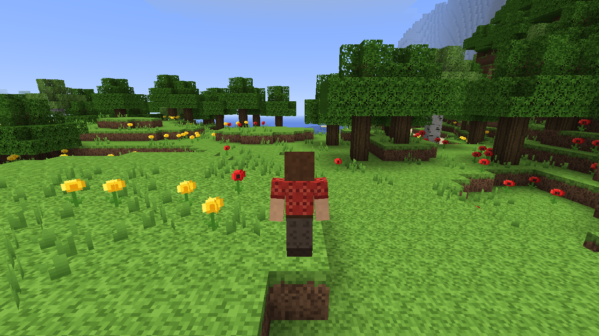

# Voxel

Воксельная 3D-игра в стиле Minecraft на языке **Odin** с самописным движком
(GLFW + OpenGL 3.3, без игровых фреймворков). Развивается маленькими шагами
по 0.001 версии — см. [CHANGELOG.md](../CHANGELOG.md).



## Сборка и запуск

Нужны: компилятор Odin и MSVC Build Tools (линкер).

```bat
run.bat              :: собрать (релиз) и запустить
build.bat            :: только релизная сборка -> bin\voxel.exe
build.bat debug      :: отладочная сборка с проверками -> bin\voxel_debug.exe
```

`build.bat` ищет `odin` в PATH, иначе берёт `%USERPROFILE%\tools\odin\odin.exe`.

## Управление

| Клавиша | Действие |
|---|---|
| W A S D | ходьба |
| Space | прыжок (в воде — всплыть) |
| Ctrl или двойное W | бег |
| Shift | присесть (не даёт упасть с края) |
| Мышь | обзор |
| F5 | камера: от первого лица → сзади → спереди |
| F2 | скриншот в `screenshots/` |
| Esc | отпустить мышь; ещё раз Esc — выход |
| ЛКМ | снова захватить мышь |

## Структура

```
src/
  engine/        самописный движок: окно и ввод, шейдеры, текстуры, хеши/шум
  main.odin      игровой цикл, фиксированные тики 20/с
  blocks.odin    типы блоков и их свойства
  textures.odin  процедурные пиксельные текстуры 16x16
  skin.odin      скин персонажа 64x64 (или assets/skin.png)
  world.odin     чанки 16x128x16, подгрузка вокруг игрока
  worldgen.odin  рельеф, горы, пляжи, леса, трава и цветы
  mesher.odin    меши чанков: отсечение граней, AO, тени
  player.odin    физика и коллизии игрока
  player_model.odin  модель и анимации персонажа
  camera.odin    камеры 1-го/3-го лица, покачивание при ходьбе
  sky.odin       небо, солнце, облака
  renderer.odin  отрисовка кадра
  shaders.odin   GLSL
docs/            референсы и скриншоты версий
```

## Свой скин

Положите PNG 64×64 со стандартной раскладкой Minecraft в `assets/skin.png` —
он заменит встроенного персонажа.

## Отладочные параметры

`bin\voxel.exe -shot:out.png -delay:3 -cam:back|fp|front -yaw:0 -pitch:15 -walk -sprint -jump -sneak -strafe -orbit:90 -burst:6 -interval:0.1 -seed:123 -size:1280x720`
— автоматический скриншот (или серия) и выход. `-dump-textures:tex.png` сохраняет все текстуры блоков.
