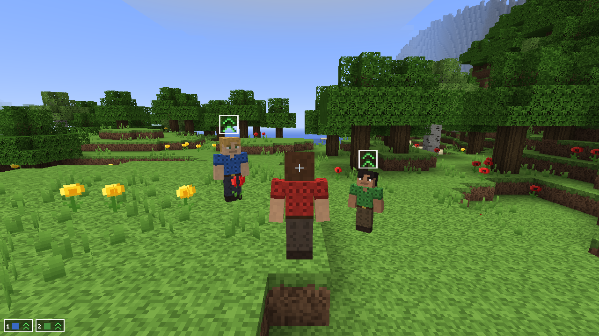
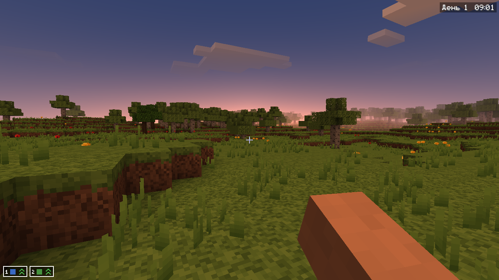
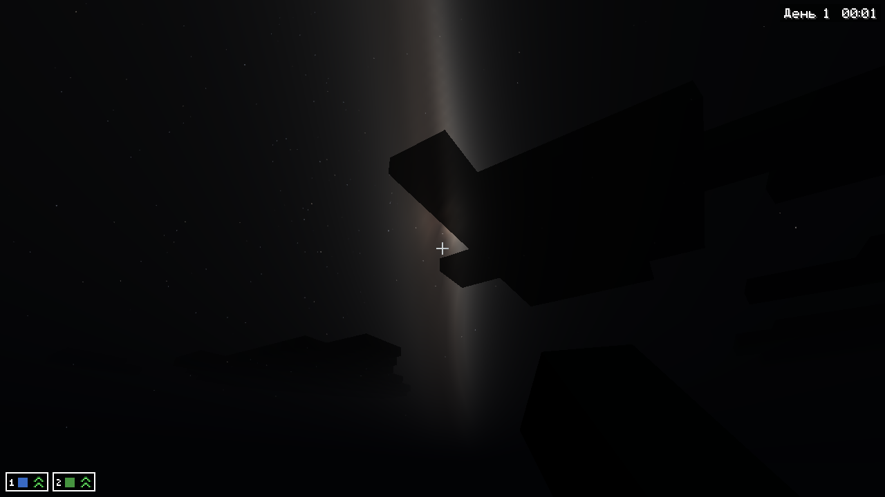
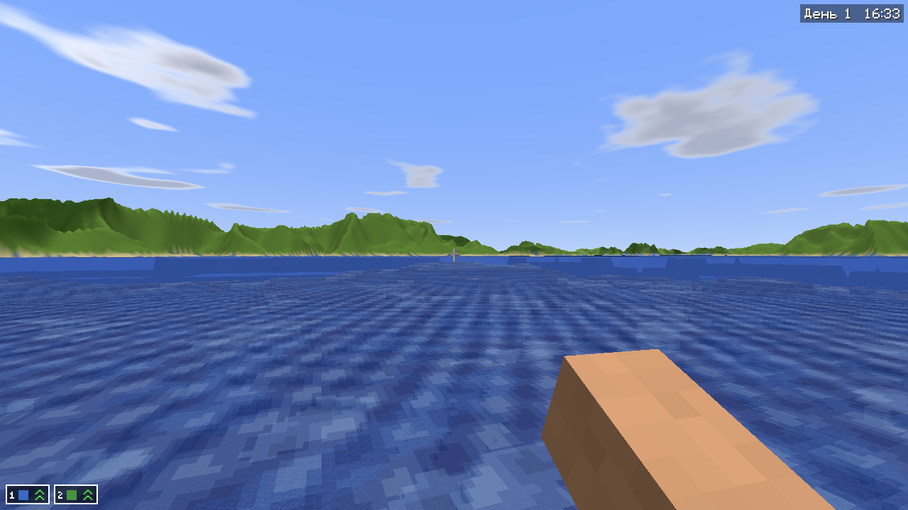
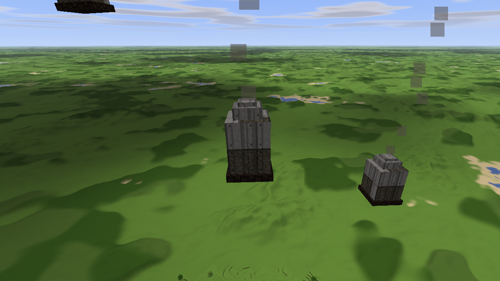
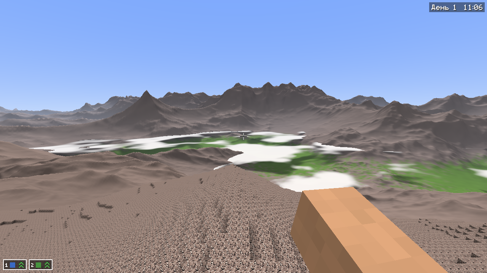
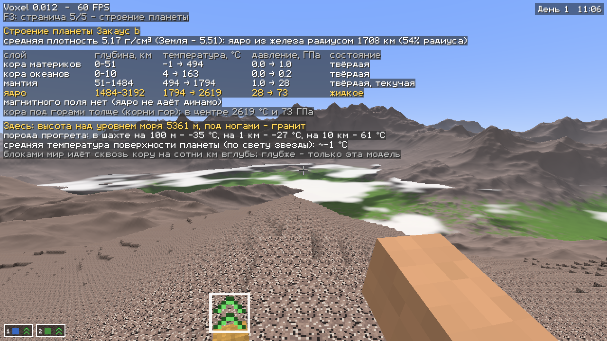
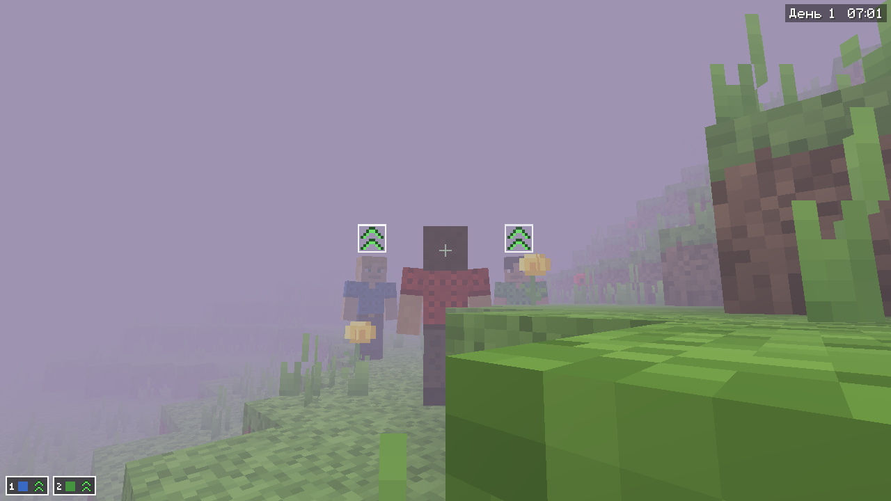
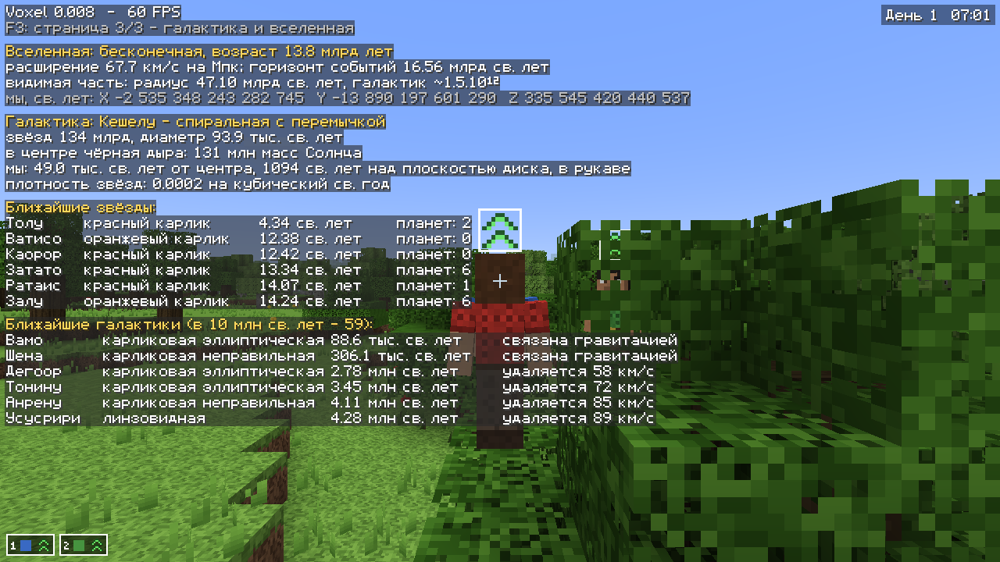

# Voxel

Воксельная 3D-игра в стиле Minecraft на языке **Odin** с самописным движком
(GLFW + OpenGL 3.3, без игровых фреймворков). Развивается маленькими шагами
по 0.001 версии — см. [CHANGELOG.md](../CHANGELOG.md).



## Отряд

С игроком двое спутников. Клавишами 1/2/3 выбери, кому отдать приказ
(выбранные — в белой рамке над головой и на панели слева внизу), затем:
**F** — за мной, **H** — стой, **G** — иди туда, куда смотрит прицел.
Дойдя до точки, спутники ждут там, пока не дашь новый приказ.

## Сборка и запуск

Нужны: компилятор Odin и MSVC Build Tools (линкер).

```bat
run.bat              :: собрать (релиз) и запустить
build.bat            :: только релизная сборка -> bin\voxel.exe
build.bat debug      :: отладочная сборка с проверками -> bin\voxel_debug.exe
```

`build.bat` ищет `odin` в PATH, иначе берёт `%USERPROFILE%\tools\odin\odin.exe`.

## Управление

| Клавиша | Действие |
|---|---|
| W A S D | ходьба |
| Space | прыжок (в воде — всплыть) |
| Ctrl в воде | плыть (лёжа, по направлению взгляда) |
| Shift в воде | нырнуть |
| Ctrl или двойное W | бег |
| Shift | присесть (не даёт упасть с края) |
| Мышь | обзор |
| F5 | камера: от первого лица → сзади → спереди |
| 1 / 2 / 3 | выбрать спутника 1, 2 или обоих |
| F | приказ «За мной» |
| H | приказ «Стой» |
| G | приказ «Иди туда» — в блок под прицелом |
| F2 | скриншот в `screenshots/` |
| F3 | страницы: мир и планета → звёздная система → галактика и вселенная → звёздное небо → строение планеты → выкл |
| Esc | отпустить мышь; ещё раз Esc — выход |
| ЛКМ | снова захватить мышь |

## Структура

```
src/
  engine/        самописный движок: окно и ввод, шейдеры, текстуры,
                 immediate-рендер, пиксельный шрифт, хеши/шум, ГСЧ
  main.odin      игровой цикл, фиксированные тики 20/с
  blocks.odin    типы блоков и их свойства
  textures.odin  процедурные пиксельные текстуры 16x16
  skin.odin      скин персонажа 64x64 (или assets/skin.png)
  world.odin     мир из секций 16³ без потолка и дна, колонки, подгрузка вокруг игрока
  relief.odin    рельеф настоящего масштаба: материки, океаны, плато, горные пояса
  worldgen.odin  колонки и секции: поверхность, пласты пород, леса, трава и цветы
  interior.odin  строение планеты: кора, мантия, ядро, температуры, давление
  mesher.odin    меши чанков: отсечение граней, AO, тени
  character.odin физика, коллизии и состояние анимаций персонажа
  humanoid_model.odin  модель и анимации персонажа
  companion.odin спутники: приказы, ИИ, поведение в ожидании
  pathfind.odin  поиск пути по блокам (A*)
  squad_ui.odin  значки приказов, метки целей, панель отряда, прицел
  bignum.odin    длинные целые числа — координаты вселенной без края
  universe.odin  вселенная: расширение, космическая паутина, галактики, наш дом
  stars.odin     звёзды галактик: типы, сетки по типам, поиск звёзд вокруг точки
  universe_info.odin  сведения для F3 и отчёт -universe с самопроверками
  star_system.odin  система планет у звезды
  game_time.odin игровое время (стандартные часы)
  astro.odin     небесная механика: орбиты, вращение, солнце, луны, свет, сезоны
  astro_check.odin  проверка неба за год и поиск затмений (-sky)
  starsky.odin   звёздное небо: видимые глазом звёзды, пыль, полоса галактики (в фоне)
  far_terrain.odin  дальний рельеф до горизонта: тайлы на шаре, уровни детализации (в фоне)
  clouds.odin    облака на настоящей высоте, их тени и шум (общий с шейдерами)
  hud.odin       часы и панель F3
  landing.odin   высадка в капсулах
  capsule.odin   модель капсулы и парашюта
  black_hole.odin эффект чёрной дыры (линза, ядро, кольцо)
  particles.odin частицы (дым, пыль, искры, вихрь)
  planet.odin    планета-шар: грани куба, их стыки, широта/долгота
  frame.odin     переход через ребро грани (смена кадра)
  globe.odin     глобус планеты для F3
  camera.odin    камеры 1-го/3-го лица, покачивание при ходьбе
  sky.odin       цвета дневного неба
  renderer.odin  отрисовка кадра
  shaders.odin   GLSL
docs/            референсы и скриншоты версий
```

## Высадка

Игра начинается с падения: ты и двое спутников летите к планете в
одноместных капсулах. Мышью можно оглядываться, WASD немного уводят
капсулу в сторону. Парашют сорвёт — посадка будет жёсткой. После удара
персонаж сам выскакивает и отбегает, а капсула схлопывается, как в
чёрную дыру. Дальше — управление твоё.

## Мир и время

Каждый запуск создаёт новый мир со своей звёздной системой: звезда, число
планет, размер и гравитация нашей планеты, длина суток и года, луны — всё
случайно. Время идёт по суткам планеты: 1 стандартный час = 100 секунд.
Сведения о мире — на F3. Повторить мир можно флагом `-seed:число`.

## Небо, сутки и времена года

Всё считается из настоящего положения планеты: она летит вокруг звезды по
эллипсу и вращается вокруг наклонённой оси. Отсюда восход и закат, длина
дня, времена года, полярный день и ночь; местное время зависит от долготы.
Солнце — настоящего размера и цвета своей звезды, луны — с фазами, бывают
солнечные и лунные затмения. Ночь честная: светят только луны, в безлунную
ночь почти ничего не видно. Сила тяжести планеты влияет на прыжки и падение;
если прыжка не хватает на блок — персонаж залезает на уступ.



Ночью на небе — настоящие звёзды нашей галактики: видно столько, сколько
увидел бы глаз, а сколько их — зависит от того, где в галактике наш дом.
Поперёк неба — полоса галактики с тёмными прожилками пыли, соседние
галактики видны туманными пятнами, планеты системы — яркими точками.
Луна и сумерки гасят слабые звёзды. Подробности — на четвёртой странице F3.



## Обзор до горизонта

Мир виден до настоящего горизонта. Вблизи — блоки, дальше — упрощённая
поверхность из того же генератора: холмы, горы, моря и острова, песок, леса —
тёмно-зелёными массивами. Планета — шар, поэтому горизонт настоящий: стоя
видно на 7–11 км, из капсулы при высадке — на 70–100 км, с высоких гор —
на сотни километров, а горы и острова выглядывают из-за горизонта. Даль тонет в
воздушной дымке: днём голубеет, на закате теплеет, ночью темнеет.



Облака — на настоящей высоте, 1–4 км: мягкие, плывут по ветру, где-то
ясно, где-то сплошная облачность. На закате они розовеют, ночью закрывают
звёзды, а их тени бегут по земле — в тени облака темнее. Аномалии видны
издалека: сиреневый купол тумана над горизонтом.



Дальность обзора, горизонт и облачность над головой — на первой странице F3.

## Горы, океаны и недра

Высота мира настоящая: мир из блоков не имеет ни потолка, ни дна. У каждой
планеты своя доля океана — от почти засушливых до почти сплошь водных миров.
Океаны — километры глубиной (у берегов мелкий шельф), горы — длинные хребты
в 2–5 км с редкими вершинами до 8 км; на лёгкой планете горы выше. Выше
2,8 км — голые скалы, вершины протыкают облака, а с них видно море облаков
внизу и хребты за сотни километров.



Под почвой — пласты песчаника и известняка, под ними гранит (под
материками) или базальт (под океанами), глубже — мантия. Глубже коры мир
описан моделью: мантия, жидкое и твёрдое ядро, температура и давление по
глубине, магнитное поле — всё из массы и радиуса планеты. Это — пятая
страница F3, там же видно, что под ногами и как прогрета порода в глубине.



## Планета

Мир — планета-шар реального размера, её можно обойти кругом. Широта,
долгота и маленький глобус с отметкой «мы здесь» — на F3. Высадка в
умеренных широтах; флаг `-latlon:40,120` — высадиться в заданной точке.

Внутри планета устроена как «раздутый куб» из 6 граней. Переход с грани на
грань незаметен, а в восьми вершинах куба — аномалии: густой серо-сиреневый
туман и столп из неразрушимого тёмного камня. Они отмечены на глобусе.



## Вселенная

Вселенная бесконечная — края нет совсем, — с настоящими расстояниями и
расширяется, как наша. В ней космическая паутина из нитей и скоплений
галактик, галактики всех типов со спутниками и чёрными дырами в центре,
звёзды всех типов — от красных карликов до голубых звёзд, нейтронных звёзд
и чёрных дыр. Любая звезда получает свою систему планет. Ничего не хранится:
всё вычисляется из зерна мира, поэтому одно зерно — одна и та же вселенная.

Наша звезда — где-то в случайной галактике. Где именно, какие звёзды и
галактики рядом — на третьей странице F3. Флаг `-universe` печатает
подробный отчёт и проверяет генерацию (в том числе в 10¹⁰⁰⁰ св. лет от нас).



## Свой скин

Положите PNG 64×64 со стандартной раскладкой Minecraft в `assets/skin.png` —
он заменит встроенного персонажа.

## Отладочные параметры

`bin\voxel.exe -shot:out.png -delay:3 -cam:back|fp|front -yaw:0 -pitch:15 -walk -sprint -jump -sneak -strafe -orbit:90 -burst:6 -interval:0.1 -seed:123 -time:21:30 -f3 -nointro -latlon:40,120 -size:1280x720 -select:1|2|3 -order:follow|hold|go -order_at:0.5 -spawn:water|mountain|cliff -edge:20 -anomaly:60`
— автоматический скриншот (или серия) и выход. `-f3:1`…`-f3:5` — сразу открыть
нужную страницу F3. `-edge:метров` / `-anomaly:метров` —
высадка у ребра грани / у вершины куба; `-selftest` — проверить стыки граней и выйти.
`-universe` — отчёт о вселенной с самопроверками и выход. `-sky` — проверка неба за год и
список ближайших затмений. `-timescale:N` — ускорить время, `-day:N` — день года при высадке,
`-hours:N` — начать через N стандартных часов, `-look:sun|moon|pole|core` — смотреть на солнце,
луну, полюс мира или центр галактики.
`-alt:метров` — поднять камеру (вид с высоты), `-view:км` — ограничить дальность рельефа,
`-novsync` — без вертикальной синхронизации (замер скорости; в отчёте — среднее время кадра),
`-off:far,clouds,shadows,haze` — выключить дальний рельеф, облака, их тени или дымку.
`-dump-textures:tex.png` сохраняет все текстуры блоков.
